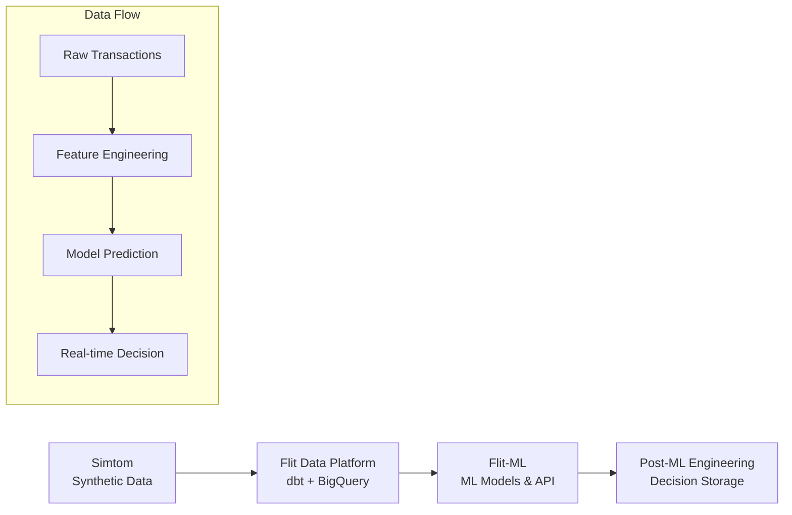

# Flit-ML: BNPL Risk Assessment - Project Roadmap

## Project Overview

Flit-ML implements ML components for real-time BNPL (Buy Now, Pay Later) risk assessment, integrating with the existing Flit ecosystem:



## Architecture Alignment with GitHub Issue

This roadmap aligns with [GitHub Issue #1](https://github.com/whitehackr/flit-ml/issues/1) phases:

### Phase 0: Research & Discovery ✅ (In Progress)
- **Data Source**: `flit-data-platform.flit_staging.stg_bnpl_raw_transactions` (1.9M records)
- **Goal**: Achieve >75% baseline accuracy with <100ms latency

### Phase 1: Production Infrastructure
- **Target**: 99%+ uptime, <100ms API response time
- **Integration**: Real-time prediction API with existing ecosystem

### Phase 2: Real-time Processing
- **Throughput**: 100+ predictions/second
- **Architecture**: Streaming feature engineering + batch predictions

### Phase 3-5: Advanced MLOps & Production
- **Monitoring**: Data drift detection, model performance tracking
- **Deployment**: A/B testing, automated retraining, production rollout

## Repository Structure Evolution

Building on [PR #2](https://github.com/whitehackr/flit-ml/pull/2) foundation:

```
flit-ml/
├── docs/                           # 📚 Documentation (GitHub .md + Mermaid)
│   ├── architecture/               # System design decisions
│   ├── models/                     # Model documentation & math
│   ├── data/                       # Data schema & lineage
│   └── deployment/                 # Production guides
├── flit_ml/                        # ✅ Existing package structure
│   ├── config/                     # 🆕 Configuration management
│   ├── data/                       # ✅ BigQuery integration (extend)
│   ├── features/                   # 🆕 Feature engineering
│   ├── models/                     # ✅ Model implementations (extend)
│   ├── evaluation/                 # 🆕 Model evaluation framework
│   ├── api/                        # ✅ FastAPI service (extend)
│   └── monitoring/                 # 🆕 Observability
├── research/                       # 🆕 ML Research
│   ├── notebooks/                  # Jupyter notebooks
│   ├── experiments/                # MLflow experiments
│   └── reports/                    # Research findings
├── scripts/                        # 🆕 Deployment scripts
└── [existing: tests/, pyproject.toml, etc.]
```

## Implementation Plan - PR Structure

### PR #3: Repository Structure & BigQuery Integration
**Building on PR #2 foundation:**
- Add missing directories and documentation framework
- BigQuery connection with service account (`flit-data-platform-dev-sa.json`)
- Data access layer for `flit_staging.stg_bnpl_raw_transactions`
- Initial schema analysis and validation

### PR #4: Data Analysis & Feature Engineering
- Comprehensive EDA of 1.9M BNPL records (42 fields)
- Domain-specific feature engineering (payment velocity, risk indicators)
- Feature validation and statistical analysis
- Documentation of feature business logic

### PR #5: ML Research & Model Selection
- Research notebooks with systematic model comparison
- Baseline implementations: Logistic Regression, Random Forest, XGBoost
- Model evaluation with BNPL-specific metrics
- Latency benchmarking (<100ms requirement)

### PR #6: MLOps Infrastructure
- MLflow setup for experiment tracking
- Model registry and versioning
- A/B testing framework design
- Performance monitoring setup

### PR #7: Production API Service
- Real-time prediction API (<100ms latency)
- Integration with existing Flit ecosystem
- Input validation and error handling
- Production deployment configuration

### PR #8: Monitoring & Observability
- Data drift detection
- Model performance tracking
- Business KPI monitoring (approval rates, default rates)
- Integration with post-ML data engineering pipeline

## Key Technical Decisions

### Documentation Strategy
- **Format**: GitHub .md files (aligned with ecosystem)
- **Diagrams**: Mermaid for architecture visualization
- **Math**: LaTeX notation in markdown for model formulations
- **API**: OpenAPI specs embedded in FastAPI

### Data & Model Strategy
- **Data Source**: Existing clean BQ table (no synthetic data generation needed)
- **Model Target**: Binary classification (Approve/Deny) for Phase 0
- **Latency**: Sub-second prediction requirement
- **Deployment Strategy**:
  1. **Phase 1**: Railway deployment (free, fast iteration)
  2. **Phase 2**: Migration to BigQuery ML (enterprise approach with $300 GCP credits)
- **Integration**: FastAPI service with trained models in memory/disk

### MLOps Strategy
- **Tracking**: MLflow for experiments and model registry
- **Monitoring**: Custom monitoring integrated with existing infrastructure
- **Deployment**: Gradual rollouts with A/B testing capability

## Success Metrics

### Technical Metrics
- **Model Performance**: >75% accuracy, >0.8 AUC-ROC
- **Latency**: <100ms API response time
- **Throughput**: 100+ predictions/second
- **Availability**: 99%+ uptime

### Business Metrics
- **Risk Management**: Maintain default rates within business targets
- **User Experience**: Minimize false positives (unnecessary denials)
- **Operational**: Reduce manual review workload

## Next Steps

1. **Immediate**: Complete repository structure and BigQuery integration
2. **Week 1**: Data analysis and feature engineering
3. **Week 2**: Model research and selection
4. **Week 3**: MLOps infrastructure and production API
5. **Week 4**: Monitoring and ecosystem integration

## Document Lifecycle

This roadmap will evolve throughout the project:
1. **Active Phase**: Living document tracking current progress and decisions
2. **Completion**: Archive to `docs/archive/PROJECT_ROADMAP.md`
3. **Legacy**: Reference for understanding historical architectural decisions

---

*This roadmap evolves as we learn from data and production requirements. All architectural decisions will be documented with rationale and alternatives considered.*