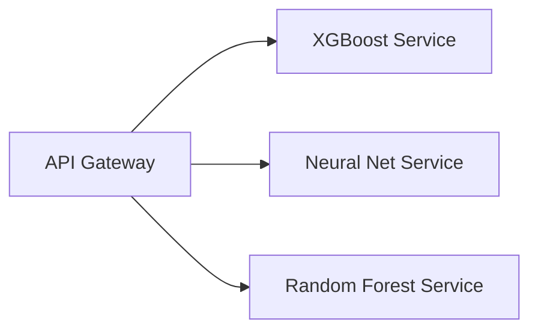
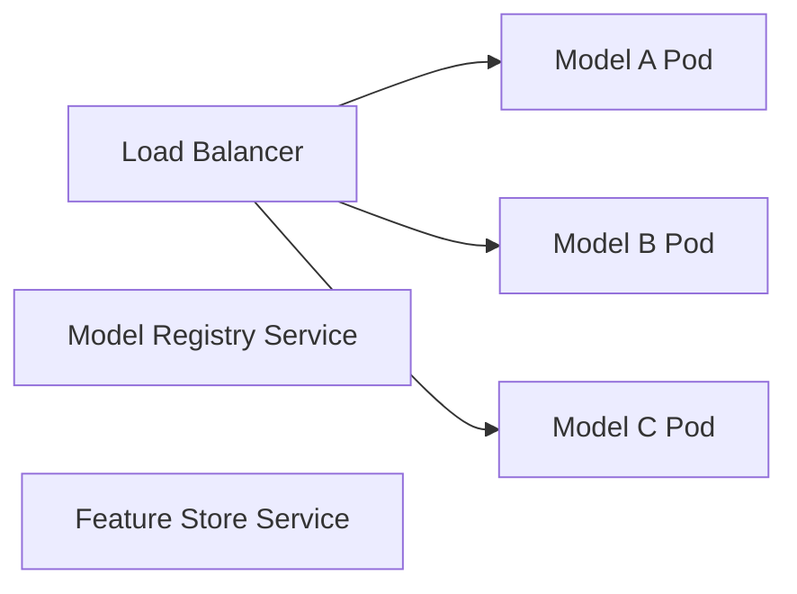

# Plugin Architecture in Flit-ML

## What is Plugin Architecture?

Plugin architecture allows **dynamic component loading** without modifying core code. Instead of hardcoding model implementations, we register them dynamically.

## Why Plugin Architecture for ML?

### **Problem with Traditional Approach:**
```python
# ❌ Monolithic Model Factory (Bad)
class ModelFactory:
    def create_model(self, model_type: str):
        if model_type == "xgboost":
            return XGBoostModel()
        elif model_type == "random_forest":
            return RandomForestModel()
        elif model_type == "neural_net":
            return NeuralNetModel()
        # Every new model requires editing this file!
```

**Problems:**
- **Tight coupling**: Adding models requires core code changes
- **Violation of Open/Closed Principle**: Not open for extension, requires modification
- **Testing complexity**: Changes affect entire factory
- **Team conflicts**: Multiple developers editing same file

### **Plugin Architecture Solution:**
```python
# ✅ Plugin-based Registry (Good)
from flit_ml import registry

@registry.decorator
class XGBoostRiskModel(BaseModel):
    name = "xgboost_risk"

    def fit(self, X, y):
        # Implementation
        pass

# Later, anywhere in code:
model = registry.get_model("xgboost_risk")
```

**Benefits:**
- **Loose coupling**: Models register themselves
- **Open/Closed Principle**: Add models without changing core
- **Easy A/B testing**: Swap models by configuration
- **Team scalability**: Developers work independently

## Architecture Comparison

### **1. Monolithic Architecture (❌ Avoid)**
```
models.py (1000+ lines)
├── XGBoostModel
├── RandomForestModel
├── NeuralNetModel
└── LogisticRegressionModel
```

**Problems:**
- Single point of failure
- Merge conflicts
- Hard to test individual models
- Violates Single Responsibility Principle

### **2. Simple Factory Pattern (⚠️ Better but Limited)**
```python
class ModelFactory:
    _models = {
        "xgboost": XGBoostModel,
        "rf": RandomForestModel
    }

    def create(self, name):
        return self._models[name]()
```

**Problems:**
- Still requires central registration
- Adding models = editing factory
- No metadata or validation

### **3. Plugin Architecture (✅ Preferred)**
```
flit_ml/
├── core/
│   └── registry.py        # Central registry
├── models/
│   ├── xgboost_model.py   # Self-registering
│   ├── rf_model.py        # Self-registering
│   └── neural_model.py    # Self-registering
└── api/
    └── prediction.py      # Uses registry
```

## Real-World Examples

### **Plugin Architecture in Production:**
1. **Jupyter Kernels**: Different language kernels register themselves
2. **VS Code Extensions**: Plugins extend functionality dynamically
3. **Flask/FastAPI Blueprints**: Route registration
4. **Airflow Operators**: Task operators register themselves
5. **MLflow Models**: Model flavors register themselves

### **Alternative Architectures**

#### **Service-Oriented Architecture (SOA)**


**Pros:**
- Language independence
- Horizontal scaling
- Fault isolation

**Cons:**
- Network latency
- Complex deployment
- Operational overhead

#### **Microservices (Extreme SOA)**


**When to use:**
- Enterprise scale (100+ models)
- Multi-team organizations
- Complex model dependencies

**When NOT to use:**
- Small teams (<10 people)
- Simple use cases
- Latency-critical applications

#### **Monolithic with Strategy Pattern**
```python
class ModelStrategy(ABC):
    @abstractmethod
    def predict(self, X): pass

class PredictionService:
    def __init__(self, strategy: ModelStrategy):
        self.strategy = strategy

    def predict(self, X):
        return self.strategy.predict(X)
```

**Good for:**
- Simple applications
- Single team
- Fast iteration

**Bad for:**
- Dynamic model loading
- A/B testing
- Multi-model serving

## Why Plugin Architecture for Flit-ML?

### **Our Context:**
- **BNPL Risk Models**: Will have multiple model types (logistic, tree-based, neural)
- **A/B Testing**: Need to switch models dynamically
- **Research Pipeline**: New models from research → production
- **Team Growth**: Multiple DS working on different models

### **Team Benefits:**
1. **Scalability**: Add models without breaking existing code
2. **Testability**: Test models in isolation
3. **Deployment**: Deploy individual models independently
4. **Experimentation**: Easy A/B testing and champion/challenger setup
5. **Maintainability**: Clear separation of concerns

## Implementation Example

```python
# Step 1: Define a model
@registry.decorator
class XGBoostBNPLModel(BaseModel):
    name = "risk_xgboost_v1"
    domain = "bnpl"

    def __init__(self, max_depth=6):
        self.max_depth = max_depth
        self.model = None

    def fit(self, X, y):
        from xgboost import XGBClassifier
        self.model = XGBClassifier(max_depth=self.max_depth)
        self.model.fit(X, y)

    def predict_proba(self, X):
        return self.model.predict_proba(X)[:, 1]

# Step 2: Use in API
from flit_ml import registry

def predict_bnpl_risk(transaction_data):
    # Model selection via config/A-B testing
    model_name = get_current_model_config()  # "bnpl.risk_xgboost_v1"
    model = registry.get_cached_model(model_name)
    return model.predict_proba(transaction_data)

# Domain-aware operations
bnpl_models = registry.list_models(domain="bnpl")
all_domains = registry.list_domains()  # ["bnpl", "logistics", "shared"]
```

## When NOT to Use Plugin Architecture

**Avoid plugins when:**
1. **Simple applications**: Single model, no variation needed
2. **Performance critical**: Nanosecond latency requirements
3. **Static requirements**: Model will never change
4. **Small team**: 1-2 developers, simple coordination

**Use simpler patterns instead:**
- Direct instantiation
- Simple factory
- Dependency injection

## Summary

Plugin architecture is **powerful for ML systems** because:
- Models evolve frequently (research → production)
- A/B testing requires dynamic switching
- Teams need to work independently
- Production requires reliability and extensibility

**Trade-offs:**
- **Complexity**: More sophisticated than direct instantiation
- **Runtime overhead**: Dynamic loading vs. compile-time
- **Debugging**: Indirect calls harder to trace

For Flit-ML, plugin architecture enables **Proper ML engineering**: maintainable, scalable, testable model management.