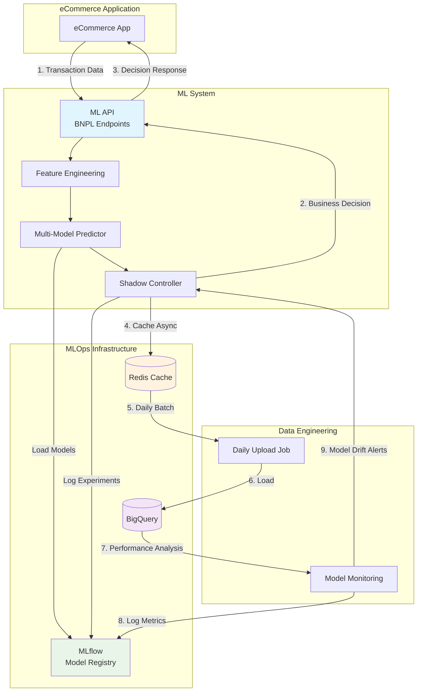
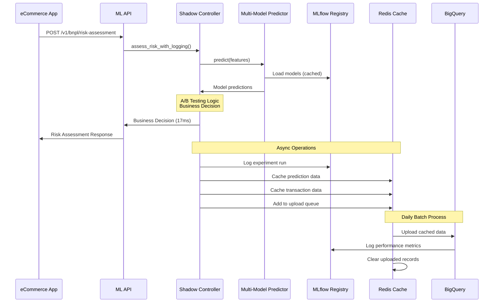

# ML Data Infrastructure Architecture

## Overview

This document defines the production data infrastructure architecture for the BNPL ML prediction system, including MLflow-based model lifecycle management, real-time caching, batch data persistence, and cross-team integration patterns.

## System Architecture

### High-Level Data Flow



### Detailed Request Flow



## Component Responsibilities

### ML System (This Repository)

**Shadow Controller:**
- Orchestrates prediction workflow
- Implements A/B testing logic via MLflow experiments
- Manages business decision policies
- Provides storage abstraction interface
- Logs experiment runs and metrics to MLflow

**Multi-Model Predictor:**
- Loads models from MLflow Model Registry
- Caches model artifacts for performance
- Provides deployment mode abstraction
- Reports model loading status to MLflow

**Storage Interface:**
- Abstracts Redis operations
- Enables local development with SQLite fallback
- Defines data schemas and access patterns

**Model Performance:**
- Defines metrics for monitoring
- Implements drift detection algorithms
- Logs performance metrics to MLflow
- Generates retraining recommendations

### Data Engineering (Flit Data Platform)

**Redis Infrastructure:**
- Provisions and manages Redis cluster
- Configures persistence and replication
- Implements connection pooling
- Monitors Redis performance

**BigQuery Integration:**
- Designs table schemas for prediction data
- Implements daily batch upload jobs
- Manages data partitioning and clustering
- Handles upload failures and retries

**Analytics Pipeline:**
- Joins prediction data with transaction outcomes
- Computes model performance metrics
- Implements drift detection queries
- Logs performance metrics to MLflow
- Generates business impact reports

### MLOps Infrastructure

**MLflow Model Registry:**
- Centralized model artifact storage
- Model versioning and stage management (dev/staging/production)
- Model metadata and lineage tracking
- Model deployment status tracking

**MLflow Tracking Server:**
- Experiment tracking for A/B testing
- Run logging with parameters, metrics, and artifacts
- Model performance metrics over time
- Integration with existing monitoring systems

**MLflow Deployment:**
- Railway deployment alongside ML API
- Shared storage backend (cloud storage or database)
- Authentication and access control
- Backup and disaster recovery

### DevOps/Platform

**Deployment:**
- Railway infrastructure management
- Redis add-on configuration
- Environment variable management
- Monitoring and alerting setup

## Data Storage Strategy

### Redis Cache Design

**Purpose:** Real-time caching with daily batch upload to BigQuery

**Data Types:**
```redis
# Prediction records
pred:{prediction_id} → JSON (prediction data)
TTL: 30 days

# Transaction records
tx:{transaction_id} → JSON (transaction data)
TTL: 30 days

# Upload queue
upload_queue → List (batch processing queue)
```

**Performance Requirements:**
- **Write latency**: <5ms per operation
- **Memory usage**: 50MB-500MB depending on transaction volume
- **Persistence**: RDB + AOF for durability
- **Concurrency**: Support multiple API container writes

### BigQuery Storage Design

**Tables:**
```sql
-- Prediction logs
flit-data-platform.flit_ml.prediction_logs
PARTITION BY DATE(timestamp)
CLUSTER BY customer_id, selected_model

-- Experiment configurations
flit-data-platform.flit_ml.experiments
PARTITION BY DATE(created_at)

-- Model performance metrics
flit-data-platform.flit_ml.model_metrics
PARTITION BY DATE(analysis_date)
```

**Data Retention:**
- **Prediction logs**: 2 years (compliance + long-term analysis)
- **Experiment data**: Permanent (research value)
- **Performance metrics**: Permanent (trend analysis)

## Performance Characteristics

### Latency Requirements

**API Response Time:** <100ms end-to-end
- Feature engineering: ~15ms
- Model inference: ~2ms
- Business logic: ~1ms
- Redis caching: <5ms (async, non-blocking)

**Batch Processing:** Daily uploads during low-traffic periods
- Redis → BigQuery: 2-6 hours processing window
- Upload batch size: 1K-10K records per job
- Error handling: Exponential backoff with manual recovery

### Scalability Planning

**Current State (5K transactions/day):**
- Redis memory: ~50MB
- BigQuery storage: ~1.5MB/day
- Upload frequency: Every 6 hours

**Future State (500K transactions/day):**
- Redis memory: ~500MB
- BigQuery storage: ~150MB/day
- Upload frequency: Every 2 hours
- Redis clustering: Consider at >100K/day

## Model Performance Monitoring

### Ground Truth Integration

**Timeline Constraints:**
- Predictions available: Immediately
- Default outcomes available: 2+ weeks later (payment cycles)
- Performance analysis cadence: Weekly
- Model drift detection: Daily

**Analysis Approach:**
```sql
-- Weekly model performance analysis
WITH predictions_with_outcomes AS (
  SELECT
    p.selected_model,
    p.selected_prediction,
    p.business_decision,
    t.will_default,
    DATE_DIFF(CURRENT_DATE(), DATE(p.timestamp), DAY) as days_since_prediction
  FROM `flit-data-platform.flit_ml.prediction_logs` p
  JOIN `flit-data-platform.flit_intermediate.int_bnpl_customer_tenure_adjusted` t
    ON p.transaction_id = t.transaction_id
  WHERE DATE(p.timestamp) BETWEEN DATE_SUB(CURRENT_DATE(), INTERVAL 5 WEEK)
                              AND DATE_SUB(CURRENT_DATE(), INTERVAL 3 WEEK)
    -- Only analyze predictions old enough for default outcomes
)
SELECT
  selected_model,
  COUNT(*) as total_predictions,
  AVG(selected_prediction) as avg_risk_score,
  AVG(CAST(will_default AS FLOAT64)) as actual_default_rate,
  -- Additional metrics: AUC, precision, recall
FROM predictions_with_outcomes
GROUP BY selected_model;
```

### Drift Detection Strategy

**Daily Distribution Analysis:**
- Compare recent prediction distributions to training baseline
- Monitor unknown category frequencies
- Alert on significant statistical changes

**Weekly Business Impact Analysis:**
- Approval rate trends
- Default rate correlation with predictions
- A/B testing statistical significance

**Monthly Model Evaluation:**
- Champion/challenger comparison
- Retraining recommendations
- Business value assessment

## MLflow Integration Architecture

### Model Lifecycle Management

**Model Registration:**
```python
# Model training pipeline registers models
mlflow.sklearn.log_model(
    model,
    "bnpl_ridge_model",
    registered_model_name="bnpl_default_predictor"
)

# Transition models through stages
client.transition_model_version_stage(
    name="bnpl_default_predictor",
    version=1,
    stage="Production"
)
```

**Model Loading in Production:**
```python
# Multi-Model Predictor loads from MLflow Registry
model_uri = f"models:/bnpl_default_predictor/{stage}"
model = mlflow.sklearn.load_model(model_uri)
```

### A/B Testing Integration

**Experiment Tracking:**
```python
# Shadow Controller creates MLflow experiments for A/B tests
experiment = mlflow.create_experiment("Ridge_vs_Logistic_Sept2025")

# Each prediction logs as a run
with mlflow.start_run(experiment_id=experiment.experiment_id):
    mlflow.log_params({
        "traffic_segment": "champion",
        "model_name": "ridge",
        "customer_segment": "high_value"
    })
    mlflow.log_metrics({
        "prediction_score": 0.234,
        "processing_time_ms": 23.4
    })
```

**Model Performance Tracking:**
```python
# Weekly performance analysis logs to MLflow
with mlflow.start_run(run_name=f"weekly_performance_{date}"):
    mlflow.log_metrics({
        "auc_score": 0.618,
        "approval_rate": 0.78,
        "default_rate": 0.049,
        "discrimination_ratio": 0.9
    })
    mlflow.log_artifact("performance_report.html")
```

### Deployment Tracking

**Model Deployment Events:**
```python
# Shadow Controller logs deployment events
mlflow.log_param("deployment_mode", "shadow")
mlflow.log_param("champion_model", "ridge_v0.1.0")
mlflow.log_param("challenger_models", ["logistic_v0.1.0"])
mlflow.log_param("traffic_allocation", {"champion": 0.7, "challenger": 0.3})
```

**Infrastructure Requirements:**
- **MLflow Server**: Deployed on Railway alongside ML API
- **Backend Store**: PostgreSQL for metadata (can share with application database)
- **Artifact Store**: Cloud storage (Railway persistent volumes initially)
- **Authentication**: Basic auth or integration with existing auth system

## A/B Testing Architecture

### Experiment Management

**MLflow Experiment Configuration:**
- Each A/B test creates an MLflow experiment
- Experiment metadata stored in MLflow backend
- Model versions tracked through MLflow Model Registry
- Statistical analysis logged as MLflow runs

**Configuration Example:**
```python
# Create MLflow experiment for A/B test
experiment = mlflow.create_experiment(
    "Ridge_vs_Logistic_Sept2025",
    tags={
        "traffic_allocation": "champion:0.7,challenger:0.3",
        "models": "ridge,logistic",
        "success_metric": "approval_rate",
        "min_sample_size": "1000"
    }
)
```

**Traffic Assignment:**
- Deterministic hash-based assignment using customer_id
- Consistent assignment across multiple requests
- Statistical validity through randomization

**Statistical Analysis:**
- Chi-square tests for categorical outcomes
- T-tests for continuous metrics
- Confidence intervals and effect sizes
- Automated significance detection

## Integration Patterns

### Cross-Team Communication

**ML → Data Engineering:**
- Prediction data schemas (defined in this document)
- Storage interface requirements
- Performance monitoring needs

**Data Engineering → ML:**
- Redis connection details and access patterns
- BigQuery table schemas and permissions
- Upload job status and monitoring

**ML → Product/Business:**
- A/B testing results and recommendations
- Model performance metrics
- Business impact analysis

### Deployment Coordination

**Phase 1: Core Infrastructure**
- Data Engineering provisions Redis on Railway
- MLOps team deploys MLflow server on Railway
- ML implements storage abstraction with Redis backend
- Model registration and loading via MLflow Registry

**Phase 2: Data Pipeline**
- Data Engineering implements daily upload jobs
- ML validates data integrity in BigQuery
- MLflow experiment tracking integration
- Performance monitoring setup

**Phase 3: Analytics & Monitoring**
- Data Engineering implements model performance queries
- MLflow performance metrics logging integration
- ML integrates drift detection with alerting
- Business stakeholder reporting via MLflow UI

## Security and Compliance

### Data Protection

**Prediction Data:**
- No PII stored in prediction logs (only IDs)
- Customer data joins handled in BigQuery with proper access controls
- Encryption at rest in both Redis and BigQuery

**Access Control:**
- Redis: Application-level access keys
- BigQuery: Service account with minimal required permissions
- MLflow: Basic auth with role-based access (admin/read-only)
- Monitoring: Separate read-only access for observability

### Data Retention

**Regulatory Compliance:**
- Prediction logs: 2-year retention for audit purposes
- Customer transaction data: Follow existing data platform policies
- Model artifacts: Permanent retention for reproducibility
- MLflow experiments: 2-year retention for compliance and analysis
- MLflow models: Permanent retention with version archival policies

## Operational Procedures

### Monitoring and Alerting

**Redis Health:**
- Memory usage >80%: Scale up alert
- Connection failures: Immediate alert
- Replication lag: Warning alert

**BigQuery Upload Status:**
- Failed uploads: Immediate alert with retry mechanism
- Upload delays >6 hours: Warning alert
- Data quality issues: Immediate alert

**Model Performance:**
- Accuracy drop >5%: Warning alert
- Unknown category frequency >5%: Warning alert
- A/B test significance detected: Notification

### Disaster Recovery

**Redis Failure:**
- Automatic failover to backup Redis instance
- Graceful degradation: predictions continue without caching
- Manual recovery: Restore from RDB/AOF backups

**BigQuery Upload Failure:**
- Retry mechanism with exponential backoff
- Manual recovery: Process failed uploads from Redis backup
- Data integrity validation after recovery

**Model Performance Degradation:**
- Automated champion model switching
- Emergency fallback to rule-based system
- Manual investigation and retraining procedures

## Future Enhancements

### Short-term (3-6 months)

**Real-time Monitoring:**
- Stream processing for immediate drift detection
- Real-time model performance dashboards
- Automated experiment management

**Advanced Analytics:**
- Causal inference for business impact
- Multi-armed bandit optimization
- Personalized risk thresholds

### Long-term (6+ months)

**MLOps Automation:**
- Automated model retraining pipelines
- Continuous deployment of model updates
- Advanced feature engineering automation

**Platform Integration:**
- Kubernetes deployment for horizontal scaling
- Advanced Redis clustering and sharding
- Real-time BigQuery streaming (when budget allows)

---

**Document Ownership:**
- **Primary**: ML Engineering Team
- **Contributors**: Data Engineering (Flit Data Platform), DevOps
- **Review Cycle**: Monthly or when major architecture changes occur
- **Last Updated**: 2025-09-27