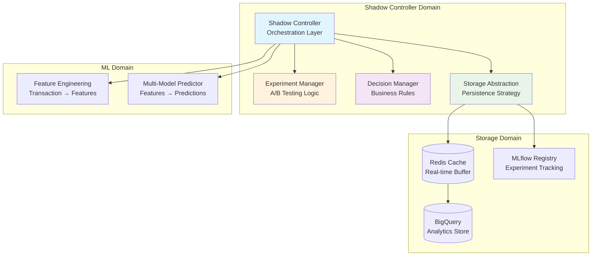
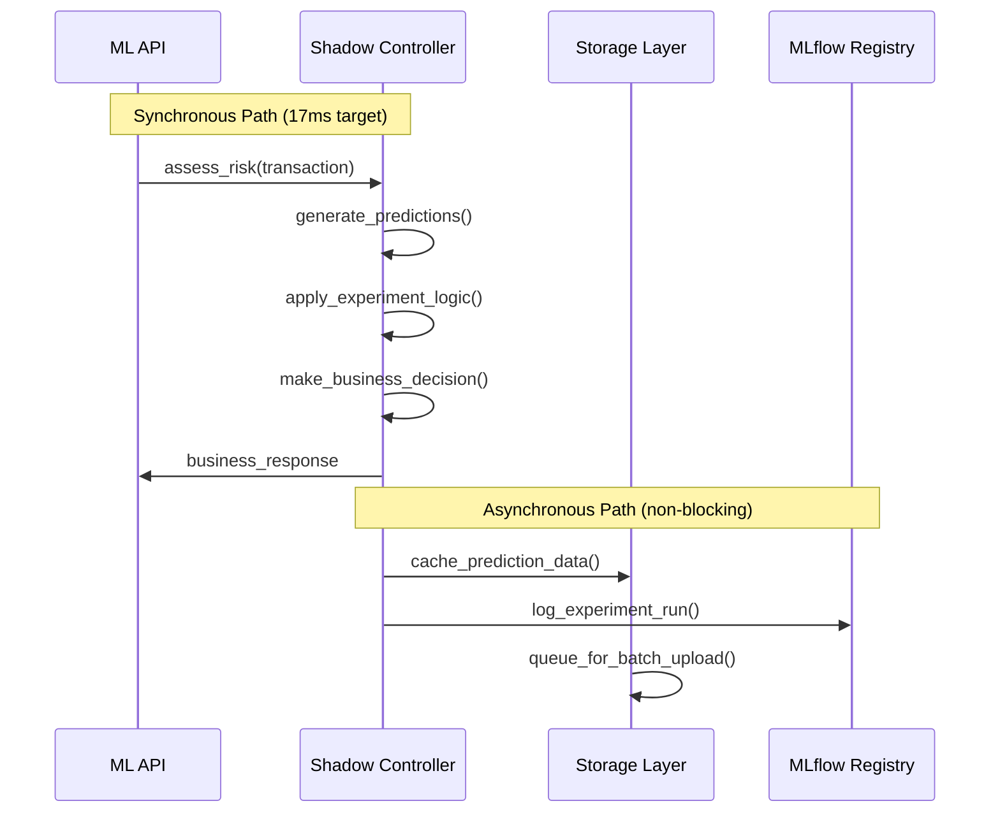

# Shadow Mode Controller Design

## Problem Context

Production ML systems face a fundamental challenge: how to safely deploy new models while maintaining business continuity and gathering performance data. Traditional blue-green deployments work for stateless applications, but ML models require sophisticated experiment management, statistical validation, and business rule integration.

The existing BNPL prediction system has individual components working effectively - feature engineering processes transactions in ~15ms, the multi-model predictor generates predictions in ~2ms, and the API responds in ~17ms. However, these components lack orchestration for A/B testing, experiment management, and systematic performance monitoring.

## Design Philosophy

### Separation of Concerns Through Orchestration

The Shadow Controller addresses architectural complexity by separating three distinct responsibilities that were previously entangled:

**Prediction Generation**: Pure ML inference without deployment concerns (handled by existing `BNPLPredictor`)
**Deployment Strategy**: A/B testing, traffic allocation, experiment management (new Shadow Controller responsibility)
**Business Integration**: Decision policies, risk thresholds, compliance logging (new Shadow Controller responsibility)

This separation enables independent optimization of each layer. Prediction generation can focus on latency and accuracy. Deployment strategy can evolve experiment methodologies. Business integration can adapt to changing risk policies without touching ML code.

### Storage Abstraction for Operational Flexibility

Production ML systems evolve through distinct phases: development prototyping, initial deployment, scaling growth, and mature operations. Each phase has different storage requirements that traditional tightly-coupled architectures cannot accommodate.

The Shadow Controller implements storage abstraction not for academic purity, but for practical operational necessity. Development environments need fast iteration (SQLite). Initial production needs cost optimization (Redis caching). Growth phases need scalability (BigQuery analytics). This abstraction enables seamless transitions without architectural rewrites.

## Architecture Overview

### Component Interaction Model

### Request Processing Philosophy

The Shadow Controller implements an async-first architecture that prioritizes API response time while ensuring comprehensive data collection:

This design recognizes that business decisions must be made immediately (approve/deny/manual review), but comprehensive analytics can be processed asynchronously. The synchronous path handles only essential operations, while the async path manages experiment logging, performance tracking, and audit trails.

## Core Components

### Experiment Manager: Statistical Rigor in Production

The Experiment Manager addresses the challenge of conducting statistically valid A/B tests in production environments where business impact is immediate and irreversible.

**Traffic Assignment Strategy**: Uses deterministic hashing based on customer ID (ideal is customer ID but at v0.1.0 the data is not reasonable at a customer level so we are doing it on transaction ID) to ensure consistent assignment across multiple requests. This prevents customers from experiencing inconsistent model behavior while maintaining statistical randomness across the customer population.

**Sample Size Management**: Implements statistical power analysis to determine when experiments have sufficient data for meaningful conclusions. This prevents premature experiment termination (Type II errors) and unnecessary extended testing (resource waste).

**Experiment Lifecycle Control**: Manages experiment states (draft → active → completed) with built-in safeguards against common A/B testing pitfalls:
- **Simpson's Paradox Prevention**: Tracks customer segments to ensure balanced representation
- **Multiple Testing Correction**: Adjusts significance thresholds when comparing multiple models
- **Early Stopping Criteria**: Implements both futility analysis (stop losing experiments early) and superiority analysis (promote winning variants quickly)

### Decision Manager: Business Rule Integration

The Decision Manager bridges the gap between probabilistic ML outputs and deterministic business requirements.

**Policy Framework Design**: Implements configurable risk thresholds that can adapt to changing business conditions without code changes. Conservative policies (high=0.5, medium=0.25) prioritize risk minimization during uncertain economic periods. Aggressive policies (high=0.8, medium=0.5) maximize approval rates during growth phases.

**Dynamic Threshold Adjustment**: Recognizes that optimal risk thresholds vary by customer segment, transaction type, and market conditions. Premium customers might warrant higher risk tolerance. New customers might require additional scrutiny. Holiday shopping seasons might justify temporarily relaxed thresholds.

**Business Rule Override Logic**: Handles edge cases where model predictions should be overridden by business logic:
- **Regulatory Compliance**: Certain customer types or transaction patterns require specific handling regardless of model output
- **Customer Relationship Management**: High-value customers might receive preferential treatment
- **Risk Management**: Suspicious patterns might trigger immediate manual review

### Storage Abstraction: Operational Evolution Strategy

The Storage Abstraction addresses a fundamental challenge in production ML systems: storage requirements evolve faster than application architectures.

**Interface Design Philosophy**: Defines storage operations based on business needs rather than implementation details. The interface supports "store prediction", "retrieve experiment data", and "analyze performance trends" regardless of whether the backend is SQLite, Redis, or BigQuery.

**Implementation Strategy Evolution**:

**Phase 1 (Development)**: SQLite implementation enables rapid local development and testing without infrastructure dependencies. Developers can iterate quickly on experiment logic without Redis connectivity or BigQuery access.

**Phase 2 (Initial Production)**: Redis implementation provides real-time caching with acceptable durability. Daily batch uploads to BigQuery optimize costs while maintaining analytics capabilities.

**Phase 3 (Scale)**: Enhanced Redis clustering or direct BigQuery streaming when transaction volumes justify infrastructure investment.

This evolution path prevents premature optimization while ensuring scalability when needed.

## Data Architecture Strategy

### Prediction Log Structure Design

The prediction log serves multiple stakeholders with different requirements:

**Operational Teams**: Need transaction IDs, timestamps, and business decisions for troubleshooting customer issues
**ML Teams**: Need model predictions, feature hashes, and processing times for performance optimization
**Business Teams**: Need approval rates, risk levels, and customer segments for business impact analysis
**Compliance Teams**: Need complete audit trails with decision rationale for regulatory requirements

The log structure balances these needs while maintaining reasonable storage costs and query performance.

### Experiment Configuration Schema

Experiment configurations capture both technical parameters (traffic allocation, model selection) and business context (success metrics, stakeholder requirements). This dual nature enables technical teams to execute experiments while providing business teams with clear evaluation criteria.

**Traffic Allocation Logic**: Supports sophisticated allocation strategies beyond simple 50/50 splits. Champion/challenger experiments might use 70/30 to minimize risk. Multi-model comparisons might use equal allocation for statistical power. Gradual rollouts might start with 5% challenger traffic and increase based on performance.

**Success Metric Definition**: Clearly defines what constitutes experiment success before starting. This prevents post-hoc analysis bias and ensures objective evaluation.

## MLflow Integration Strategy

### Model Lifecycle Management

MLflow integration addresses the challenge of managing multiple model versions in production while maintaining deployment traceability.

**Model Registry Pattern**: Centralizes model artifacts with proper versioning and stage management. Models progress through Development → Staging → Production stages with clear promotion criteria. The Shadow Controller loads models by stage rather than specific versions, enabling seamless updates.

**Artifact Lineage**: Maintains connections between training experiments, model versions, and deployment events. When production issues arise, teams can quickly trace back to training data, hyperparameters, and validation results.

### Experiment Tracking Integration

**A/B Testing as MLflow Experiments**: Each business A/B test creates a corresponding MLflow experiment. Individual prediction events become MLflow runs within that experiment. This creates hierarchical organization: business experiment → model predictions → performance analysis.

**Parameter and Metric Logging**: Captures experiment parameters (traffic allocation, model selection) and real-time metrics (prediction distributions, processing times). This enables both operational monitoring and post-experiment analysis.

**Performance Monitoring Integration**: Weekly performance analysis creates dedicated MLflow runs that aggregate business outcomes. Model accuracy, approval rates, and default rates get tracked over time, enabling trend analysis and drift detection.

## Performance Optimization Strategy

### Latency Management

The Shadow Controller must not impact API response times while adding sophisticated experiment management capabilities.

**Async Operation Design**: All storage operations, MLflow logging, and analytics computations occur asynchronously after the business decision is returned. This ensures that experiment complexity doesn't affect customer experience.

**Caching Strategy**: Active experiment configurations are cached in memory with appropriate TTL. Model metadata is cached from MLflow to avoid repeated registry calls. Recent prediction distributions are cached for drift detection without database queries.

**Resource Management**: Bounded queues and connection pools prevent resource exhaustion during traffic spikes. Background tasks have lower priority than prediction requests.

### Memory Management

**Bounded Collections**: Prediction caches use fixed-size deques that automatically discard old entries. This prevents memory leaks during extended operation while maintaining recent data for analysis.

**Lazy Loading**: Experiment configurations and model metadata are loaded on demand rather than at startup. This reduces initialization time and memory usage for inactive experiments.

## Error Handling and Resilience

### Graceful Degradation Philosophy

Production ML systems must remain operational even when supporting infrastructure fails. The Shadow Controller implements layered fallback strategies.

**Storage Failure Handling**: When Redis becomes unavailable, predictions continue using in-memory caching with file backup. When BigQuery uploads fail, data accumulates in Redis with retry mechanisms. Only complete infrastructure failure prevents operation.

**MLflow Integration Resilience**: MLflow logging failures do not affect business operations. Predictions continue, experiments proceed, but tracking data may be lost. This design prioritizes business continuity over perfect observability.

**Experiment State Recovery**: When the Shadow Controller restarts, it recovers active experiment state from persistent storage. Traffic assignment remains consistent across restarts, preventing customer experience disruption.

### Data Consistency Strategy

**Eventually Consistent Design**: Accepts that prediction logs, experiment data, and performance metrics may have slight delays or temporary inconsistencies. Business decisions are always immediate and consistent, but analytics data may lag.

**Reconciliation Mechanisms**: Daily batch processes validate data consistency between Redis, BigQuery, and MLflow. Discrepancies trigger alerts but don't interrupt operations.

## Testing Strategy Philosophy

### Component Isolation Testing

**Storage Abstraction Testing**: Uses in-memory implementations for unit tests, enabling fast test execution without infrastructure dependencies. Tests focus on interface contracts rather than implementation details.

**Experiment Logic Testing**: Validates statistical properties (traffic distribution, assignment consistency) using property-based testing. Tests ensure that A/B testing logic maintains statistical validity under various conditions.

**Business Rule Testing**: Verifies decision logic across edge cases using comprehensive scenario testing. Tests ensure that business rules consistently override model predictions when required.

### Integration Testing Approach

**End-to-End Workflow Testing**: Validates complete prediction workflows using mock implementations of external dependencies. Tests ensure that async operations complete correctly and data flows through all system components.

**Performance Regression Testing**: Monitors API response times and resource usage during testing to prevent performance degradation as features are added.

## Deployment Strategy

### Phased Rollout Plan

**Phase 1: Core Infrastructure**: Deploy Shadow Controller with in-memory storage and basic experiment management. Validate API integration and performance characteristics.

**Phase 2: Storage Integration**: Integrate Redis caching and BigQuery uploads. Validate data flow and async operation performance.

**Phase 3: MLflow Integration**: Add experiment tracking and model registry integration. Validate A/B testing workflow and performance monitoring.

**Phase 4: Advanced Features**: Add sophisticated experiment analysis, personalized thresholds, and automated model promotion.

### Monitoring and Observability

**Operational Metrics**: Track API response times, async operation completion rates, and storage operation success rates. Alert on performance degradation or infrastructure failures.

**Business Metrics**: Monitor experiment participation rates, statistical power achievement, and decision policy effectiveness. Alert on unexpected business impact.

**ML Metrics**: Track prediction distribution drift, model performance trends, and experiment result significance. Alert on model degradation or experiment anomalies.

## Future Evolution Paths

### Advanced Experiment Management

**Multi-Armed Bandit Optimization**: Evolve from fixed traffic allocation to dynamic allocation based on real-time performance. This reduces the cost of exploration while maximizing the benefit of exploitation.

**Personalized Experimentation**: Implement customer-segment-specific experiments that recognize different customer populations may respond differently to model changes.

### Real-Time Adaptation

**Dynamic Threshold Adjustment**: Implement real-time risk threshold optimization based on portfolio performance and market conditions.

**Automated Model Promotion**: Develop criteria for automatic champion model updates based on statistical significance and business impact thresholds.

**Predictive Experiment Design**: Use historical experiment results to optimize future experiment parameters and improve statistical power.

---

This architecture enables sophisticated A/B testing and experiment management while maintaining the simplicity and performance of the existing ML pipeline. The storage abstraction provides operational flexibility as the system scales, while MLflow integration ensures comprehensive experiment tracking and model lifecycle management.